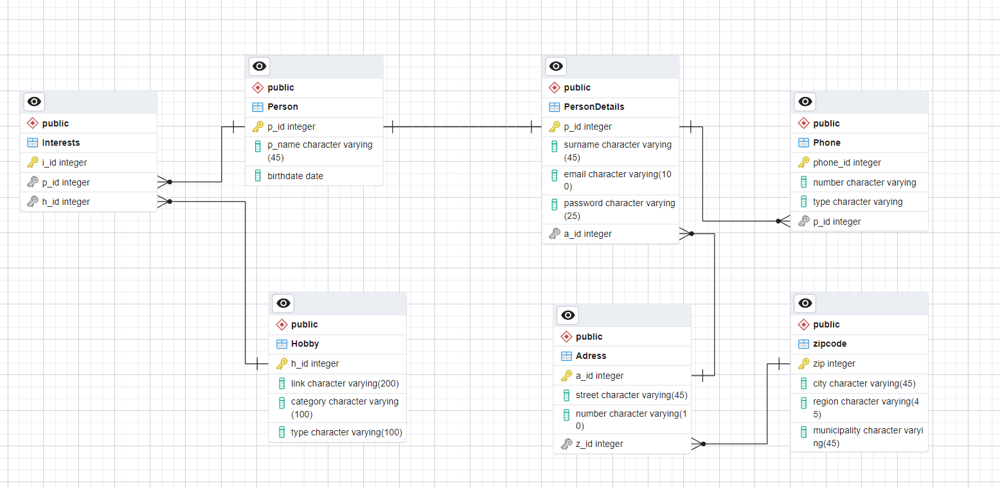

## Dat3-SP1: Hobby exercise

---

### Group
* Sebastian Klitte Egeberg - Github: **[Sebbedeb](https://github.com/Sebbedeb)**
* Lasse Baggesgård Hansen - Github: **[kotteletfisk](https://github.com/kotteletfisk)**
* Oskar Daniel Olsen - Github: **[cph-oo221](https://github.com/cph-oo221)**

---

### Business Idea Description:

HobbyMatch er en innovativ webapplikation designet til at hjælpe brugere med at finde meningsfulde forbindelser baseret på fælles hobbyinteresser. Platformen giver brugerne mulighed for at opdage ligesindede individer ved at vælge deres foretrukne hobbyer og interesser. Her er hvordan det fungerer:

__Profiloprettelse:__ Brugere begynder med at oprette en profil, hvor de angiver deres hobbyer og interesser. De kan vælge mellem et bredt udvalg af muligheder, såsom vandreture, madlavning, fotografering, gaming og meget mere.

__Matchalgoritme:__ HobbyMatch benytter en avanceret matchalgoritme, der beregner procentdelen af fælles interesser mellem brugerne. Jo højere procentdelen er, jo stærkere er den potentielle forbindelse.

__Geografisk nærhed:__ Udover fælles interesser tager applikationen også hensyn til geografisk nærhed. Brugerne præsenteres for profiler af andre, der deler deres hobbyer og er placeret i nærheden, hvilket gør det lettere at mødes personligt, hvis det ønskes.

__At vinke:__ Hvis en bruger støder på en profil, der vækker deres interesse, kan de "vinke" til den bruger for at udtrykke deres ønske om en forbindelse. Modtageren af vinke har mulighed for at acceptere eller afvise invitationen.

__Chat:__ Når en forbindelse er etableret gennem gensidig vinkning, kan brugerne begynde at chatte med hinanden inden for platformen. Dette giver dem mulighed for at lære hinanden bedre at kende, planlægge aktiviteter relateret til deres fælles interesser eller bare deltage i venlige samtaler.

HobbyMatch er ikke kun en platform til at finde potentielle romantiske partnere, men også et sted at møde nye venner, der deler dine lidenskaber. Den fremmer meningsfulde forbindelser baseret på fælles interesser og fremmer en følelse af fællesskab og tilhørsforhold blandt brugerne. Uanset om du leder efter en vandremakker, en madlavningspartner eller nogen at diskutere dine yndlingsspil med, så er HobbyMatch her for at hjælpe dig med at finde den perfekte match.

### Domain Model

---

### EER-diagram

---

### Workflow

Som et team begyndte vi med at skabe et overblik over forløbet/opgaven. Heri udarbejdede vi en forretningsidé,
der skulle passe til opgaven, hvilket kan findes ovenfor under overskriften "Business Idea Description."
Derefter begyndte vi at lave en domænemodel for at skabe et større overblik omkring vores forretningsidé/plan samt projektet som helhed.
Efter at domænemodellen var lavet, begyndte vi at udarbejde et EER-diagram. Når EER-diagrammet var på plads, oprettede vi vores projekt og Github Projects-board.

Gennem hele forløbet har vi benyttet os af Github Projects. Vi har brugt Projects til at skabe overblik i forløbet over,
hvor langt vi er i arbejdsprocessen. Vi har også brugt Projects til at holde styr på, hvilke User Stories der er i gang med at blive lavet,
testet eller er færdige. Som et team har vi alle bidraget til at holde styr på og administrere vores GitHub Project-board.

---

### Technical requirements:
* JPA
* JPQL
* Maven
* JDK 17
* JUnit 5
* Docker
* PostgresSQL
* pgAdmin
* Lombok
